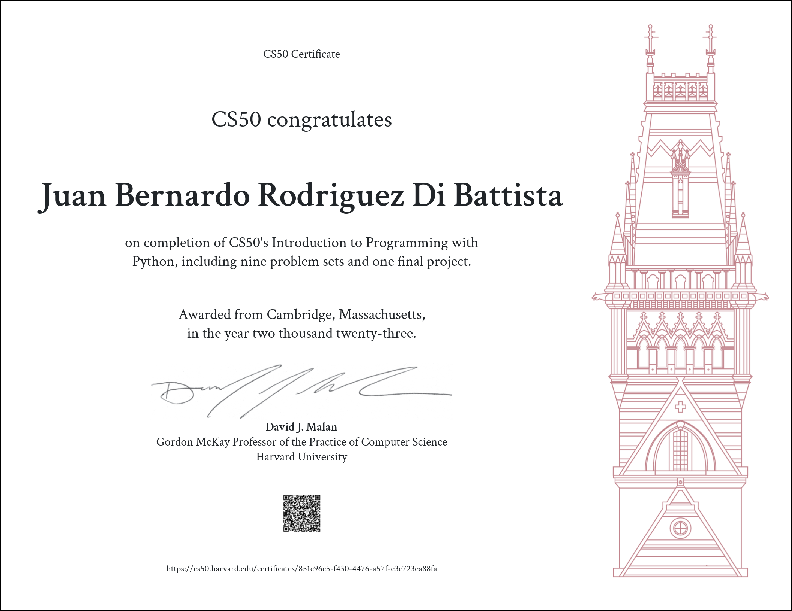

# CS50P:
---
CS50P, also known as CS50's Programming in Python, is an intensive online course that provides a comprehensive introduction to programming using Python, one of the most popular and versatile programming languages. Throughout the course, I learned various fundamental topics that form the backbone of programming and software development.

The course covered a wide range of topics, including functions, variables, conditionals, loops, exceptions, libraries, unit tests, file I/O, regular expressions, object-oriented programming, docstrings, and type hints. I gained a solid understanding of how to write efficient and effective Python code to solve real-world problems. From basic programming concepts like variables and conditionals to more advanced topics like object-oriented programming and regular expressions, I was able to build a strong foundation in Python programming.

The course also emphasized the importance of writing clean and maintainable code, including proper documentation through docstrings and type hints. I learned how to use libraries, which are pre-written code modules, to enhance the functionality of my programs and how to perform unit tests to ensure the correctness of my code. I also gained practical experience with file I/O, allowing me to read and write data to external files, and regular expressions, which are powerful tools for manipulating text data.

---
## Week 0:

- Class:
    * https://cs50.harvard.edu/python/2022/weeks/0/

- Problem Set:
    1. [Indoor Voice](https://cs50.harvard.edu/python/2022/psets/0/indoor/)
    1. [Playback Speed](https://cs50.harvard.edu/python/2022/psets/0/playback/)
    1. [Making Faces](https://cs50.harvard.edu/python/2022/psets/0/indoor/)
    1. [Einstein](https://cs50.harvard.edu/python/2022/psets/0/einstein/)
    1. [Tip Calculator](https://cs50.harvard.edu/python/2022/psets/0/tip/)
---
## Week 1:

- Class:
    * https://cs50.harvard.edu/python/2022/weeks/1/

- Problem Set:
    1. [Deep Tought](https://cs50.harvard.edu/python/2022/psets/1/deep/)
    1. [Federal Bank](https://cs50.harvard.edu/python/2022/psets/1/bank/)
    1. [File Extentions](https://cs50.harvard.edu/python/2022/psets/1/extensions/)
    1. [Math Interpreter](https://cs50.harvard.edu/python/2022/psets/1/interpreter/)
    1. [Meal Time](https://cs50.harvard.edu/python/2022/psets/1/meal/)
---
## Week 2:

- Class:
    * https://cs50.harvard.edu/python/2022/weeks/2/

- Problem Set:
    1. [CamelCase](https://cs50.harvard.edu/python/2022/psets/2/camel/)
    1. [Coke Machine](https://cs50.harvard.edu/python/2022/psets/2/coke/)
    1. [Setting Twitter](https://cs50.harvard.edu/python/2022/psets/2/twttr/)
    1. [Vanity Plates](https://cs50.harvard.edu/python/2022/psets/2/plates/)
    1. [Nutrition Facts](https://cs50.harvard.edu/python/2022/psets/2/nutrition/)
---
## Week 3:

- Class:
    * https://cs50.harvard.edu/python/2022/weeks/3/

- Problem Set:
    1. [Fuel](https://cs50.harvard.edu/python/2022/psets/3/fuel/)
    1. [Taqueria](https://cs50.harvard.edu/python/2022/psets/3/taqueria/)
    1. [Grocery](https://cs50.harvard.edu/python/2022/psets/3/grocery/)
    1. [Outdated](https://cs50.harvard.edu/python/2022/psets/3/outdated/)
---
## Week 4:

- Class:
    * https://cs50.harvard.edu/python/2022/weeks/4/

- Problem Set:
    1. [Emojize](https://cs50.harvard.edu/python/2022/psets/4/emojize/)
    1. [Fliget](https://cs50.harvard.edu/python/2022/psets/4/figlet/)
    1. [Adieu](https://cs50.harvard.edu/python/2022/psets/4/adieu/)
    1. [Game](https://cs50.harvard.edu/python/2022/psets/4/game/)
    1. [Professor](https://cs50.harvard.edu/python/2022/psets/4/professor/)
    1. [Bitcoin](https://cs50.harvard.edu/python/2022/psets/4/bitcoin/)
---
## Week 5:

- Class:
    * https://cs50.harvard.edu/python/2022/weeks/5/

- Problem Set:
    1. [Test_Twitter](https://cs50.harvard.edu/python/2022/psets/5/test_twttr/)
    1. [Test_Bank](https://cs50.harvard.edu/python/2022/psets/5/test_bank/)
    1. [Test_Plates](https://cs50.harvard.edu/python/2022/psets/5/test_plates/)
    1. [Test_Fuel](https://cs50.harvard.edu/python/2022/psets/5/test_fuel/)
---
## Week 6:

- Class:
    * https://cs50.harvard.edu/python/2022/weeks/6/

- Problem Set:
    1. [Lines](https://cs50.harvard.edu/python/2022/psets/6/lines/)
    1. [Pizza](https://cs50.harvard.edu/python/2022/psets/6/pizza/)
    1. [Scourgify](https://cs50.harvard.edu/python/2022/psets/6/scourgify/)
    1. [Shirt](https://cs50.harvard.edu/python/2022/psets/6/shirt/)
---
## Week 7:

- Class:
    * https://cs50.harvard.edu/python/2022/weeks/7/

- Problem Set:
    1. [Numb3rs](https://cs50.harvard.edu/python/2022/psets/7/numb3rs/)
    1. [watch](https://cs50.harvard.edu/python/2022/psets/7/watch/)
    1. [Working](https://cs50.harvard.edu/python/2022/psets/7/working/)
    1. [UM](https://cs50.harvard.edu/python/2022/psets/7/um/)
    1. [Response](https://cs50.harvard.edu/python/2022/psets/7/response/)
---
## Week 8:

- Class:
    * https://cs50.harvard.edu/python/2022/weeks/8/

- Problem Set:
    1. [Seasons](https://cs50.harvard.edu/python/2022/psets/8/seasons/)
    1. [Cookie](https://cs50.harvard.edu/python/2022/psets/8/jar/)
    1. [Shirt](https://cs50.harvard.edu/python/2022/psets/8/shirtificate/)
---
## Week 9:

- Class:
    * https://cs50.harvard.edu/python/2022/weeks/9/

- Final Project:
    1. [Project](https://cs50.harvard.edu/python/2022/project/)
---
## Final Project:
[**Project**](https://cs50.harvard.edu/x/2023/project/)

---

